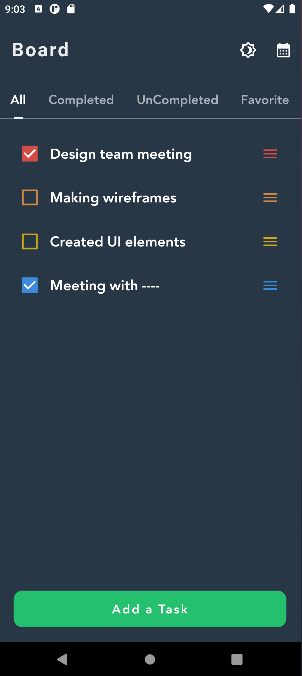
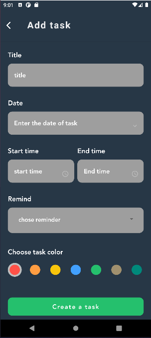
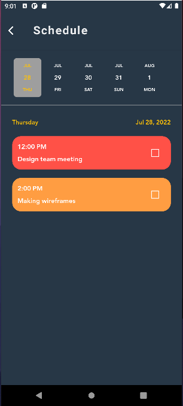
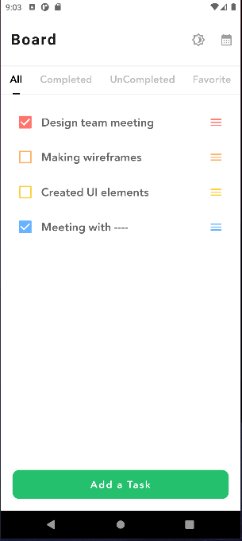
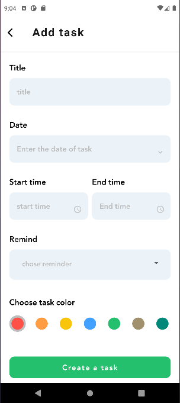
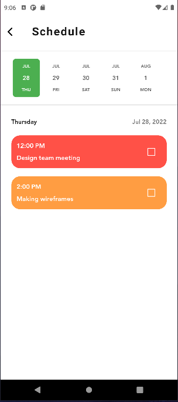

# todo_app

Task 2 in Algoriza Flutter Intern.

## Getting Started
## 🟠Project Screens
  |  |  
 | |  

## 🟠Project Video
https://user-images.githubusercontent.com/82912311/181444905-19c882eb-f375-4370-9289-e74341a3f04f.mp4
